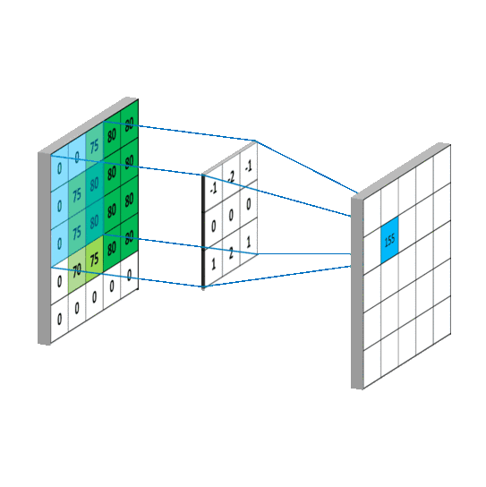
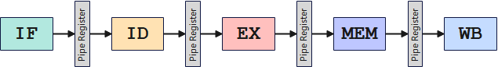
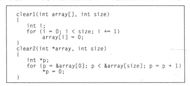
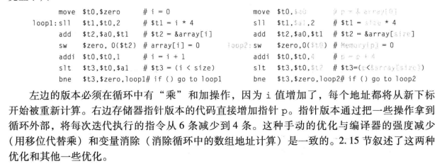

# 从高斯模糊出发，讲现代处理器架构与程序优化
## 前言
&emsp;1969年，阿波罗11号火箭登月，火箭使用的处理器算力，可能不及我们现在家用洗衣机来得高。在上个世纪，程序员想破头脑怎么去对程序进行优化，比如产生了[快速开平方根倒数](https://zhuanlan.zhihu.com/p/74728007)中让人缓缓打出**WTF**的magic number **0x5f3759df**。  
&emsp;计算机发展到今天，处理器性能非常高，我们日常用到的App，为了快速开发迭代以及跨平台，纷纷用上了webview+javascript的手段代替native框架，用运行效率换开发效率。从便捷性来说，我是挺喜欢js的一些变种的，但是从效率来说，js运行效率就是**史**。现在很多App已经不会太注重**优化**这个问题。但是对于嵌入式程序员来说，执行效率还是一个比较重要的话题。  
&emsp;本文从C++实现高斯模糊这一实例，一步步讲述如何根据现代处理器架构体系去做相对应的优化，相信看完本文你会对现代处理器架构体系有了解。文章如有错误，敬请指出。  

## 高斯模糊
&emsp;简单来说，高斯模糊就是二维矩阵卷积，通过二维高斯函数的卷积核对图像进行卷积。高斯卷积核在频域上表现为一个低通滤波器，卷积的结果就是过滤掉图像的高频成分，是图像变得**平滑**，肉眼看去，就是变模糊了。  
  
&emsp;具体原理介绍可以参考我的[CSDN文章](https://blog.csdn.net/u010519174/article/details/116126914)。同样的，我们也可以使用均值卷积核去代替高斯，时域上表现为一个窗函数采样，频域上表现为Sinc函数。均值滤波的缺点是Sinc函数还带有一定的高频成分，滤波得到的图像不那么平滑，但是可以多次进行卷积，频域上就表现为$Sinc^n$，n=3的时候，频域就和高斯函数十分接近了。  

## 运行环境
```
系统：    Windows10
处理器：  AMD Ryzen 5600U
内存：    DDR4 3200MHz 16GB
编译器:   MinGW-W64
IDE:     CodeBlocks(Release,关闭-O优化)
图片大小: 1920*1080
```

## C++实现
&emsp;我们使用C++读取BMP文件去实现图像的读写，文末会放Github链接，读者可以点击链接获取代码。c++读取得到一个结构体包含图像信息，其中最重要的几个成员为：
```
info.biWidth   :图像的宽度
info.biHeight  :图像的高度
stride         :图像每一行像素所占的字节数
content        :图像所有像素信息，为一维数组。按行存储，每行占stride个字节，每个像素占3个字节，分别按照B G R通道逐列顺序存储。
```
&emsp;比如我们要读取(x,y)位置的RGB信息，那么对应在content的位置为：
```
R = content[y*stride+x+2];
G = content[y*stride+x+1];
B = content[y*stride+x+0];
```
&emsp;首先我们通过最基本的二维卷积实现高斯模糊这一功能。先把卷积核计算出来，开一个新的数组用来存储。使用二重循环遍历所有像素，再使用二重循环遍历所有半径为Radius的像素，进行卷积操作，同时进行边界判断，防止数组越界。分析算法复杂度，有着$O(W^2*R^2)$的复杂度，对于大半径的高斯模糊，复杂度非常高。
```
void BMP::GaussianBlurFloat(int radius){
    float *weights=CreateGaussianKernelFloat(radius);

    byte *newContent=new byte[this->info.biSizeImage]; //分配内存
    for(int j=0;j<info.biHeight;j++){ // 遍历像素(二重循环)
        for(int i=0;i<info.biWidth;i++){
            float rSum=0,gSum=0,bSum=0;
            int wi = 0;
            for(int v=-radius;v<=radius;v++){ // 卷积操作(二重循环)
                for(int u=-radius;u<=radius;u++){
                    if(u+i<0||u+i>=info.biWidth||v+j<0||v+j>=info.biHeight){ //防止越界
                        continue;
                    }
                    int base = ((j+v)*stride) + (u+i)*3;
                    
                    bSum += content[base+0] * weights[wi];
                    gSum += content[base+1] * weights[wi];
                    rSum += content[base+2] * weights[wi];
                    wi++;
                }
            }
            int base = (j*stride) + i*3;
            newContent[base+0]=bSum;
            newContent[base+1]=gSum;
            newContent[base+2]=rSum;
 
        }
    }
    delete weights;
    delete this->content;
    this->content=newContent;
}
```
&emsp;传入参数radius=10，执行该函数，对运行时间进行计时，得到用时为**4970ms**。显然，这是非常糟糕的性能(没开编译器优化)。接下来，我们将对这个算法一步一步进行优化。  
原图：  
  
高斯模糊：  
  

## 定点数优化
&emsp;上述算法使用了**float**浮点数进行计算，从二进制的角度来说，浮点数计算的工作量比整数计算要高很多，现代处理器的浮点性能必然低于整数性能。在此例中，浮点数的取值范围(Logscale)并不大，我们完全可以使用定点数的方法进行计算，同时使用移位代替除法。  
```
void BMP::GaussianBlurInt(int radius){
    int *weights=CreateGaussianKernelInt(radius);
    byte*newContent=new byte[this->info.biSizeImage]; //分配内存
    for(int j=0;j<info.biHeight;j++){
        for(int i=0;i<info.biWidth;i++){
            int rSum=0,gSum=0,bSum=0;
            int wi = 0;
            for(int v=-radius;v<=radius;v++){
                for(int u=-radius;u<=radius;u++){
                    if(u+i<0||u+i>=info.biWidth||v+j<0||v+j>=info.biHeight){
                        continue;
                    }
                    int base = ((j+v)*stride) + (u+i)*3;
                    
                    bSum += content[base+0] * weights[wi];
                    gSum += content[base+1] * weights[wi];
                    rSum += content[base+2] * weights[wi];
                    wi++;
                }
            }
            int base = (j*stride) + i*3;
            newContent[base+0]=bSum>>15;
            newContent[base+1]=gSum>>15;
            newContent[base+2]=rSum>>15;
        }
    }
    delete weights;
    delete this->content;
    this->content=newContent;
}
```
&emsp;统计运行时间为**4464ms**，比**float**的**4970ms**要快了那么一点。但是，还是远远不够！因为现代PC处理器堆了很多电路在计算浮点数上，所以差距不算大，但是对于单片机等嵌入式处理器来说，浮点数也定点数的性能差距是非常大的。  

## 算法优化
&emsp;前面提到过，高斯卷积核可以使用均值卷积核进行多次卷积等效。对于均值卷积核，我们不需要使用乘法进行卷积，直接把元素加起来，可以降低运算量，因为做加法的速度比做乘法要快。
```
void BMP::MeanBlur(int radius){
    byte *newContent=new byte[this->info.biSizeImage]; //分配内存
    int len = radius*2+1;
    int div = len*len;
    for(int j=0;j<info.biHeight;j++){
        for(int i=0;i<info.biWidth;i++){
            int rSum=0,gSum=0,bSum=0;
            for(int v=-radius;v<=radius;v++){
                for(int u=-radius;u<=radius;u++){
                    if(u+i<0||u+i>=info.biWidth||v+j<0||v+j>=info.biHeight){
                        continue;
                    }
                    int base = ((j+v)*stride) + (u+i)*3;
                    
                    bSum += content[base+0];
                    gSum += content[base+1];
                    rSum += content[base+2];
                }
            }
            int base = (j*stride) + i*3;
            newContent[base+0]=bSum/div;
            newContent[base+1]=gSum/div;
            newContent[base+2]=rSum/div;
        }
    }
    delete this->content;
    this->content=newContent;
}
```
&emsp;我们用3次均值模糊去代替高斯模糊，同时均值模糊的等效半径比高斯要大，在实现相同的模糊效果下，统计运行时间为**2257ms**，比前面的高斯卷积核要快一倍。但是这个时间还是不够的。  
  

## 分支优化
&emsp;在上面的算法中，在四重循环内，每次都先做一个边界判断再执行。乍一看，对于大部分的像素，它们都不在边界，只需要执行一个判断语句，然后就可以进行相加操作。其实不然，首先判断里面存在一定的计算，再者，复杂的分支会导致CPU性能不能完全发挥出来。  

&emsp;现代的处理器架构是流水线的，把**取址、译码、执行、访存、写回**五个步骤分了大约12级。流水线优点是能降低每一级的逻辑延时，使得CPU能够以更高的频率运行，增大处理器的吞吐量。但是流水线伴随着3大冒险：**结构冒险、数据冒险、控制冒险**。现代处理器做了很多设计去处理这些问题。  
&emsp;因为流水线的存在，在把if指令送进流水线的下一个周期，CPU会选择什么？  
&emsp;1、选择等if执行完才把if要执行的语句送进流水线？必不可能，这样子太慢了。  
&emsp;2、固定选if成立或者不成立的分支进流水线？这是一个运气的问题。  
&emsp;3、if的2条分支都同时送进2个流水线进行处理，等if出来了再去选择分支。部分设计是这么做的，比较耗资源。  
&emsp;4、从前面if的跳转情况去进行分支预测。目前大部分的设计都是这么做的，分支预测能够使得循环内大部分的时间都不会遇到控制冒险，只有在边界才有可能发生控制冒险。目前大部分CPU都在优化分支预测结构。  
&emsp;虽然CPU有硬件级的分支预测单元，我们是不是可以在编程的时候，降低遇到控制冒险的可能性呢？答案是可以。首先在编程的时候，是有一些宏语句，让编译器通知处理器，这一条分支跳到哪里的可能性更高，让CPU更倾向于把这一条分支的内容送进流水线。我们不使用这样的宏语句，用朴素一点的方法：边界条件判断不写在大循环内。
```
void BMP::MeanBlurBranch(int radius){
    byte *newContent=new byte[this->info.biSizeImage]; //分配内存
    int len = radius*2+1;
    int div = len*len;

    // ------------------------边界处理代码------------------------
    // ***********************************************************
    
    for(int j=radius;j<info.biHeight-radius;j++){ // 非边界像素
        for(int i=radius;i<info.biWidth-radius;i++){
            int rSum=0,gSum=0,bSum=0;
            for(int v=-radius;v<=radius;v++){
                for(int u=-radius;u<=radius;u++){
                    int base = ((j+v)*stride) + (u+i)*3;
                    
                    bSum += content[base+0];
                    gSum += content[base+1];
                    rSum += content[base+2];
                }
            }
            int base = (j*stride) + i*3;
            newContent[base+0]=bSum/div;
            newContent[base+1]=gSum/div;
            newContent[base+2]=rSum/div;
        }
    }

    delete this->content;
    this->content=newContent;
}
```
&emsp;统计运行时间为**1571ms**，比前面的**2257ms**又快了一些。

## 指针优化
&emsp;说到指针，这对于大部分人来说是一个很棘手的东西，同时写出来的代码会变得十分难读，非常的dirty。数组的下标访问，转换成汇编语言，就是根据数组的基地址加上下标*类型字节数，然后再对这个地址进行读取，而指针访问可以省一些操作。以《计算机组成与设计  硬件软件接口 第5版》的第96页中的一个例子解释这一过程。  

  
指针版本的部分代码，在非边界像素的处理代码中，使用指针代替下标访问。
```
void BMP::MeanBlurPointer(int radius){
    byte *newContent=new byte[this->info.biSizeImage]; //分配内存
    int len = radius*2+1;
    int div = len*len;

    // ------------------------边界处理代码------------------------
    // ***********************************************************

    byte *oc_ptr;
    byte *nc_ptr;
    byte *t_ptr;
    int gap = stride-3*len;
    for(int j=radius;j<info.biHeight-radius;j++){ // 非边界像素
        oc_ptr = &content[j*stride+radius*3];
        nc_ptr = &newContent[j*stride+radius*3];
        for(int i=radius;i<info.biWidth-radius;i++){
            int rSum=0,gSum=0,bSum=0;
            t_ptr = oc_ptr - stride*radius - 3*radius;
            for(int v=-radius;v<=radius;v++){
                for(int u=-radius;u<=radius;u++){
                    // t_ptr = &content[(j+v)*stride+(u+i)*3];
                    bSum += *(t_ptr++);
                    gSum += *(t_ptr++);
                    rSum += *(t_ptr++);
                }
                t_ptr += gap;
            }
            *(nc_ptr++)=bSum/div;
            *(nc_ptr++)=gSum/div;
            *(nc_ptr++)=rSum/div;
            oc_ptr+=3;
        }
    }

    delete this->content;
    this->content=newContent;
}
```
&emsp;统计运行时间为**1277ms**，比前面的**1571ms**又快了一些，但是这个速度，还不够。

## 算法优化(DP优化)
&emsp;又回到了算法优化这一问题，这次我们要做的优化就是减少重复的工作。一个均值的卷积操作可以分解为像素逐行卷积，得到的结果再逐列卷积。在逐行（列）求和的过程中，我们可以减少一些重复工作，当求和的窗口移动时，我们可以加右边一个像素再减右边一个像素的方式，让求和的复杂度和窗口宽度即卷积半径无关。那么整个算法的复杂度就从$O(W^2*R^2)$变成$O(W^2)$，与模糊半径无关。因为使用过指针之后代码及其丑陋，这里只放部分代码。
```
void BMP::MeanBlur1Dim(int radius){
    byte *newContent=new byte[this->info.biSizeImage]; //分配内存
    byte *dst = newContent;
    byte *src = content;
    int len = 2*radius + 1;

    // --------------------- 省略代码 ---------------------
    // ***************************************************
    for(int j=0;j<info.biHeight;j++){
        byte *src_ptr_l = &src[j*stride];
        byte *src_ptr_r = &src[j*stride];
        byte* dst_ptr = &dst[j*stride];
        int rSum = 0,gSum = 0,bSum = 0;
        // --------------------- 省略代码 -----------------
        // ***********************************************
        for(int i=radius+1;i<info.biWidth-radius;i++){ // 非边界像素
            bSum += *(src_ptr_r++) - *(src_ptr_l++);
            gSum += *(src_ptr_r++) - *(src_ptr_l++);
            rSum += *(src_ptr_r++) - *(src_ptr_l++);
            *(dst_ptr++) = bSum / len;
            *(dst_ptr++) = gSum / len;
            *(dst_ptr++) = rSum / len;
        }
        // --------------------- 省略代码 -----------------
        // ***********************************************
    }
    // --------------------- 省略代码 ---------------------
    // ***************************************************
}
```
&emsp;统计运行时间为**72ms**，比前面的**1277ms**快了很多，已经非常可观了。

## CPU多发射优化
&emsp;如果CPU只有一条流水线，即所有指令都只能从一个通道进行译码执行，那么CPU的性能就完全取决于主频，再做一些分支预测之类的优化去降低控制冒险导致的效率问题。那么CPU的性能早就到头了，因为主频已经没有多少提升的幅度了。
&emsp;现代CPU是多发射超标量的。形象的比喻是，单发射是一个工人在做一个任务，多发射是2个以上工人在做一个任务，这种设计可以让CPU在一个时钟周期执行多条指令。但是程序是顺序执行的，上一条语句还没执行完毕的同时执行下一条语句，是会出现计算错误的。  
&emsp;设计者当然会考虑到这一点。所以在多发射的同时，会在编译器的层面和处理器硬件的层面，在不影响程序执行结果的情况下，打乱一定范围内的指令，让处理器可以同时执行几条互不相干的指令。  
&emsp;我们可以在编程的时候，让附近的指令不那么相干，让处理器尽可能地**多发射**。对上面代码进行一些修改：
```
void BMP::MeanBlur1Dim(int radius){
    byte *newContent=new byte[this->info.biSizeImage]; //分配内存
    byte *dst = newContent;
    byte *src = content;
    int len = 2*radius + 1;

    // --------------------- 省略代码 ---------------------
    // ***************************************************
    for(int j=0;j<info.biHeight;j++){
        byte *src_ptr_l = &src[j*stride];
        byte *src_ptr_r = &src[j*stride];
        byte* dst_ptr = &dst[j*stride];
        int rSum = 0,gSum = 0,bSum = 0;
        // --------------------- 省略代码 -----------------
        // ***********************************************
        for(int i=radius+1;i<info.biWidth-radius;i++){ // 非边界像素
            bSum += *(src_ptr_r) - *(src_ptr_l);
            gSum += *(src_ptr_r+1) - *(src_ptr_l+1);
            rSum += *(src_ptr_r+2) - *(src_ptr_l+2);
            src_ptr_r+=3;src_ptr_l+=3;
            *(dst_ptr) = bSum / len;
            *(dst_ptr+1) = gSum / len;
            *(dst_ptr+2) = rSum / len;
            dst_ptr+=3;
        }
        // --------------------- 省略代码 -----------------
        // ***********************************************
    }
    // --------------------- 省略代码 ---------------------
    // ***************************************************
}
```
&emsp;这里的处理是让每一个``ptr++``变成```(ptr+1) (ptr+2)```，最后再```ptr+=3```，目的是为了让rgb通道的计算不会因为前后产生的数据冒险(需要等待++完成)而不能多发射。执行100次，对比未做优化和做了优化的时间，其中未做优化为**2499ms**，做了优化为**2411ms**，区别比较小，因为虽然关闭了编译优化，但是处理器层面还是会进行一定的乱序发射。  

## 缓存优化
&emsp;单独执行上面经过多发射优化代码中的行模糊和列模糊各100次，得到行模糊耗时为**1029ms**，列模糊耗时为**1627ms**，还是有挺大区别的。为什么？
&emsp;现代处理器结构还有一个优化就是**Cache**缓存，现代CPU基本都分了3级缓存L1 L2 L3，从电路上来说，它们是SRAM，最小单位为6 MOS管。拆开CPU的Die发现，里面缓存的规模会比CPU核心要大。理想的状态下，如果变量全都存在离CPU最近的L1,那么获取变量的延时几乎可以忽略不计。但是事实是SRAM的面积太大，而且离CPU越远，传输到CPU的延时就会越大，所以L1做不大，一般都是几十KB,最大的L3最多也是几十MB。Cache存在的意义是降低CPU从DDR内存获取数据的延时的敏感性。文末有[网站](https://colin-scott.github.io/personal_website/research/interactive_latency.html)可以让大家了解计算机内各个组件的延时。DDR比Cache的延时要大得多。虽然DDR延时大，但是其带宽并不小，比如DDR4 3200，再一定的内存延时后以25.6GBps的带宽送进CPU。  
&emsp;现代CPU有一定的设计，让CPU常用的数据都存在Cache内，Cache再和DDR内存进行数据交换。当Cache未命中时，CPU就需要等待Cache从DDR内存获取数据，这样会减慢指令执行速度。  
&emsp;对于程序来说，因为数据是按行存储的，每一行相邻像素在内存里面都是连续的。所以行模糊的时候基本不会发生Cache未命中。但是在列模糊的时候，基本操作是访问上下行的像素，这些像素之间的地址差了stride，就会加大Cache未命中的概率。
&emsp;对于我们的程序，这一部分就没什么优化的空间了，这是是不可避免的。在频繁访问大规模数组的时候，可以对数组进行一定重排降低Cache未命中概率。  

## 编译器优化
&emsp;这一步是最简单的优化，因为是IDE自动开启的。开启g++的-O3优化后，编译器会根据现代CPU架构，进行多发射、乱序执行等优化。这里进行时间对比。
|                                         | 未开启-O3 | 开启-O3 |
|-----------------------------------------|----------|-------|
| float高斯卷积核                          | 4970ms | 1324ms |
| int高斯卷积核                            | 4464ms | 1012ms |
| 3x均值卷积核                               | 2257ms | 462ms |
| 3x均值卷积核+分支优化                       | 1571ms | 315ms |
| 3x均值卷积核+分支优化+指针                  | 1277ms | 222ms |
| 3x均值卷积核+分支优化+指针+DP优化            | 72ms | 61ms |
| 100x均值卷积核+分支优化+指针+DP优化          | 2442ms | 2043ms |
| 100x均值卷积核+分支优化+指针+DP优化+多发射优化| 2392ms | 2023ms |
| 100x全部优化(仅行模糊)                      | 1029ms | 1009ms |
| 100x全部优化(仅列模糊)                      | 1627ms | 1285ms |

## 更多优化
### SIMD优化
&emsp;SIMD即Single Instruction Multiple Data单指令流多数据流，可以利用它来加速向量操作。对于X86处理器，可以使用AVX512指令去提高计算性能。  
### GPU优化
&emsp;GPU的设计原则就是让每个核心的计算延时高、性能低，但是其面积非常小，适合实现大规模阵列，实现高并行度计算。  

## 总结
&emsp;相信看到这里，你已经对现代处理器架构有所了解，在日常的程序编写中，可以根据自己的理解去对程序进行优化，实现更高的性能。

### 链接
快速开平方根倒数：[https://zhuanlan.zhihu.com/p/74728007](https://zhuanlan.zhihu.com/p/74728007)  
CSDN高斯模糊：[https://blog.csdn.net/u010519174/article/details/116126914](https://blog.csdn.net/u010519174/article/details/116126914)  
计算机内部延时：[https://colin-scott.github.io/personal_website/research/interactive_latency.html](https://colin-scott.github.io/personal_website/research/interactive_latency.html)  
Github代码：[https://github.com/HeroChan0330/Mordern-CPU-Arch-and-Program-Optimize](https://github.com/HeroChan0330/Mordern-CPU-Arch-and-Program-Optimize)
